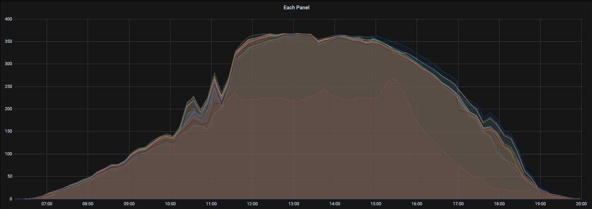

# envoyPerInverter

This is a shell script for pulling each inverter(panel) output from a **local** Enphase Envoy, this does not use the Enlighten API.  

The script will pull the data to insert into an influx database.

[Inspired by](https://github.com/lambfrier/enphase-envoy-local-monitoring/issues/1) issue on enphase-envoy-local-monitoring


## Installation

Requires the following:

```
curl
jq
influx commmnad line
```

Edit the script for your environment.


## Usage
Add to cron to collect for your desired interval.  I have mine setup to 10 minute intervals.  

## Issues
There is absolutely no error checking in the script.  

## Screenshot



## License
[MIT](https://choosealicense.com/licenses/mit/)